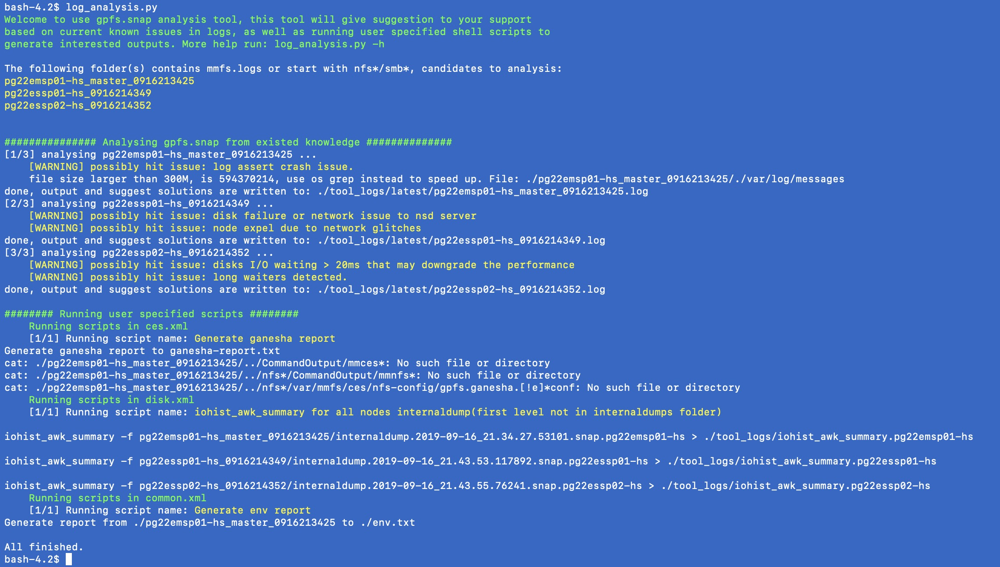

# Spectrum-Scale-Level2-Tools
A collection of scripts for use in analyzing GPFS snaps, logs, dumps and traces.

https://github.ibm.com/Spectrum-Scale-Level2/Spectrum-Scale-Level2-Tools

These scripts are available on the debug servers in ECuRep in:

/common/public/git/linux/tools/Spectrum-Scale-Level2-Tools

These scripts are available on the debug servers in Blue Diamond in:

/standard/tools/spectrum-scale-level2/spectrum-scale-level2-tools

Note: Unless otherwise indicated by the "Origin" these scripts were originally copied from
service5.pok.stglabs.ibm.com:/data5/bin in March-April 2018, and this repository is now
the authoritative location for the most up-to-date version.


## log_analysis.py

This tool helps to analysis the GPFS.snap, it can do 2 things:
* Give known solution to known issues by log pattern compare scan.
* Run pre-defined cmd, which can used to grep useful data or nice report from snap.

```
log_analysis.py -h
Usage: This is gpfs.snap analysis tool that reuse current known solution/knowledge base(under conf/.xml)
to determine the issue and give solution.
Also run the user shell scripts to help analysis per each problem field.(scripts defined in conf/.xml as well)

How to use: cd to unpacked gpfs.snap folder, then run:
    {PATH}/log_analysis.py -m {mode}
    Current support mode:
       disk: scan disk related issues,
       hang: scan long waiters, hang, deadlock related issues,
       network: scan network related issues,
       perf: scan performance related issues,
       common: scan common issues.
Tip: If no mode specifed, all modes under conf/ will be used to check logs.

Options:
  -h, --help            show this help message and exit
  -d START_DATE, --date=START_DATE
                        Filter for logs after the date, ex: 2019-07-01 or Sat
                        Feb 25. If not found the string started with the input
                        value, just ignore and search all.
  -m SELECTED_MODE, --mode=SELECTED_MODE
                        current supported
                        mode:'common','disk','hang','network','perf' can set
                        multiple mode.
  -n NODES, --nodes=NODES
                        filter the participant nodes by fuzzy matching.
  -s, --script-only     Only run scripts, no existing issues check.
  -c, --check-only      Only check existing issues, no scripts running.

```

